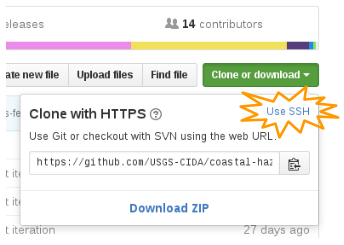

# Using git with HTTPS Intercept
## Disclaimer
This document is an informal collaboration between USGS users of git. The document is not an official recommendation. Pull requests to improve this guide are welcomed.

## Background
The USGS is decrypting HTTPS traffic for the purposes of security scanning. This causes many programs (see [note 1](#note-1)) to break unless additional configuration steps are performed. Git requires reconfiguration. There are two ways to get git working again. One way involves updating git's HTTPS configuration. Another way involves switching git to a different protocol called SSH.

## Switch git to use SSH
SSH is a more secure way to communicate with your remote git server (like GitHub, etc.). SSH is also easier to use day-to-day because it eliminates password prompts. Compared to HTTPS, SSH can be slightly more difficult to set up when running Windows. Mac and Linux users should have an easier time.

* Follow these instructions for creating SSH key pairs
 * https://help.github.com/articles/generating-an-ssh-key/
* Then follow these instructions for changing existing repos from HTTPS to SSH remote urls
 * https://help.github.com/articles/changing-a-remote-s-url/#switching-remote-urls-from-https-to-ssh
* You can get the ssh url for your existing repos through the GitHub web ui by clicking the "Clone or download" button, and then the "Use SSH" link as shown in the following screenshot.

* Troubleshooting
 * Windows-only: If you need to import an OpenSSH key into Pageant, follow these instructions
   https://kb.site5.com/shell-access-ssh/how-to-convert-ssh-keys-to-ppk-format/

## To Continue Using git with HTTPS (a.k.a. SSL)
HTTPS is a secure protocol, but it is not as secure as SSH (see [note 2](#note-2)). Day-to-day use of HTTPS is not as convenient because it requires regular password prompts, whereas SSH does not. HTTPS may be easier to set up initially than SSH.

* Ensure your machine is connected to a DOI internal network
   * OK:
      * Plugged in to the network in a DOI building
      * Using the VPN from home
      * Using the VPN from a coffee shop
      * Using the VPN from wifi in a DOI building
    * Not OK:
       * Using wifi connections in DOI buildings without using the VPN. Although you may be able to , this configuration could .
       * Using wifi at home without using the VPN
       * Using wired internet at home without using the VPN
       * Using wifi at a coffee shop without using the VPN
* Download the new DOI Root Certificate Authority certificate from here
 * http://blockpage.doi.gov/images/DOIRootCA.crt
* Now configure git to trust the new DOI Root Certificate Authority certificate by running

  `git config --global http.sslCAInfo C:\path\to\your\DOIRootCA.crt`

## Do Not
Some misguided advice has been circulating that advocates for shutting off HTTPS certificate verification via commands like:
 

 
DO NOT DO THAT. It is a threat to our security and scientific integrity.

If you have done that, your git credentials may have been intercepted. Consider all of your git activities compromised. Consider alerting your bureau security officer and your bureau officer of Scientific Integrity. Follow these steps to return to a secure configuration.

* On each computer where you use git, re-enable SSL (a.k.a. HTTPS) Verification as the default for all of your repositories by running:

 `git config --global http.sslVerify "true"`
* Each repository has the option to override the global default. If you overrode the default in your repositories, then for each overriding repository change to the repository's folder and run

 `git config http.sslVerify "true"`
* Change your password on your git hosting site (ex: Github, Bitbucket, Gitlab, Gitorious, etc)
* Consider switching to SSH as mentioned earlier in this document.
* Consider enabling Two Factor Authentication
  * [GitHub](https://help.github.com/articles/securing-your-account-with-two-factor-authentication-2fa/)
  * [Bitbucket](https://confluence.atlassian.com/bitbucket/two-step-verification-777023203.html)
  * [GitLab](https://docs.gitlab.com/ce/profile/two_factor_authentication.html)

Now that you are using a safe configuration, you will need to perform some forensic analysis and recovery. This should include, but should not be limited to the following steps.
* Inspect every commit in the history in all of the repositories that you have write access to. This includes repositories on your local hard drives, personal forks at git hosting sites, and organizational repositories at git hosting sites that you have write access to.
* On git hosting sites (like GitHub, etc), ensure that your user's affiliation to various teams remains the same.
* If you were an administrator of a team or organization on your git hosting site (like GitHub, etc), ensure that no members of the team/org have been added or removed. Ensure that members have the expected permissions.

## Notes
####Note 1

For example, besides git, SSL intercept can also cause issues when running wget, initializing or updating a Vagrant box, or package managers like apt, yum, or dnf.

####Note 2

The problem isn't so much the SSL protocol itself, but rather the fallible forest of trust that automatic SSL certificate verification relies on. Dan Goodin wrote [an excellent explanation of these problems](http://www.theregister.co.uk/2011/04/11/state_of_ssl_analysis/?page=1). By contrast, SSH keys are verified by the user on a case-by-case basis.
